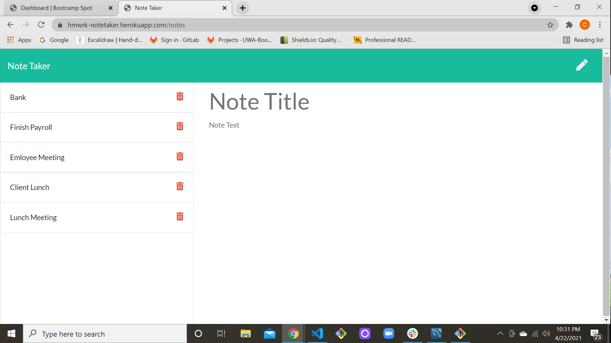

  # Note-Taker
  
  ## Description 
       This application allows the user to take notes that conatain a title and text body. The  notes are saved and available for editing, as well as  deleting to help keep the user organized.
  ## Table of contents
  * [Description](#description)
  * [Installation](#installation)
  * [Usage](#usage)
  * [License](#license)
  * [Contributing](#contributing)
  * [Tests](#tests)
  * [Questions](#questions)
  ## Installation
  
  This application is a live deployed application and can opened at: [Note Taker](https://hmwrk-notetaker.herokuapp.com/notes)
  ## Usage 
          To use this application the user needs to open it in a browser. Then displayed will be a home page that has a link to where you can input notes. On the notes page the user has an input for the title and another for the text body of the note. Once complete a save icon will appear in the right corner allowing the user to save the note.
  ## License
          MIT
  ## Contributing
          
  ## Tests
          N/A
  ## Questions
   Any questions regarding this application please feel free to contact me at: 
      - E-mail moecory11@gmail.com
      - Github:
      <https://github.com/moecory11>
      